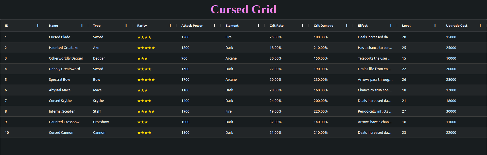

# Cursed Grid: A non-solution to optimize data fetching in AG Grid Viewport Row Model

<p align="center">
    
    <br />
    <br />
    <em>Swift and precise, but balanced by sacrifice</em>
</p>

Database cursors x AG Grid's Viewport Row Model. An experiment. A non-solution.

The name is _not_ a reference to Grandblue Fantasy; although, [the game looks super cool][grandblue-belial].

Why a katana? Because Kaito.
Also, a katana resting on a stand forms a grid-like shape, symbolizing precision and speed balanced within a structured framework. This captures the concept of slicing through data efficiently, yet requiring careful handling to manage performance and storage trade-offs.

> 

See also:

- [PostgreSQL: Documentation: 17: 41.7. Cursors](https://www.postgresql.org/docs/current/plpgsql-cursors.html)

- [Granblue Fantasy: Versus Belial Trailer - YouTube][grandblue-belial]

- [Granblue Fantasy's MOST CURSED Grid?!? - YouTube](https://www.youtube.com/watch?v=j6c1Ba7zfoE)


## Technologies used

- Vue/Vite

- AG Grid:
    * [x] Theme: `ag-theme-alpine-dark`.
    * [x] Viewport Row Model
        + https://www.ag-grid.com/javascript-data-grid/viewport/
    * [ ] Loading skeleton
        + https://www.ag-grid.com/javascript-data-grid/component-loading-cell-renderer/

- Postgres 16

- JDBC

- Javalin


## Original idea

```
The main idea:
    backend-managed database cursors
    If the initial query (complex joins or whatever) is slow, and offset/limits are slow
    just do it once
    maintain the cursor on the backend and just scroll it on the frontend

Workflow:

    The frontend makes a query
    A websocket connection is established
    JDBC executes it and holds a cursor
    The frontend scrolls, requests new data, the websocket returns

    If the data changes, the websocket is closed, freeing the cursor.
    If the connection is idle, close it.

    A subsequent request re-starts the process.

Using:
    Vue 3
    AG Grid Viewport Row Model
    Postgres
    JDBC
    Javalin or Vert.x
```

## A non-tutorial

### Create the database and table

```sql
CREATE DATABASE wonderworks

\c wonderworks

CREATE USER hatter WITH PASSWORD '123456';

ALTER USER hatter WITH SUPERUSER;
```

### Table

```sql
CREATE TABLE weapons (
    id SERIAL PRIMARY KEY,
    name VARCHAR(50) NOT NULL,
    type VARCHAR(20) NOT NULL,      -- e.g., Sword, Bow, Staff
    rarity INTEGER CHECK (rarity BETWEEN 1 AND 5),  -- Star rating, 1-5 stars
    attack_power INTEGER,           -- Base attack power
    element VARCHAR(20),            -- Fire, Water, Wind, Earth, etc.
    crit_rate DECIMAL(4, 2),        -- Critical hit rate, e.g., 0.15 for 15%
    crit_damage DECIMAL(5, 2),      -- Critical damage multiplier, e.g., 1.5 for +50% damage
    effect_description TEXT,        -- Description of the weapon's special effect
    level INTEGER DEFAULT 1,        -- Level of the weapon, typically 1-20 or similar
    upgrade_cost INTEGER,           -- Cost to upgrade the weapon
    creation_date TIMESTAMP DEFAULT CURRENT_TIMESTAMP -- When the weapon was added
);
```

### Fake data

```sql
INSERT INTO weapons (
    name,
    type,
    rarity,
    attack_power,
    element,
    crit_rate,
    crit_damage,
    effect_description,
    level,
    upgrade_cost
)
SELECT
    CONCAT(
        CASE WHEN random() < 0.5 THEN 'Flame' ELSE 'Aqua' END,
        CASE WHEN random() < 0.5 THEN ' Edge' ELSE ' Strike' END,
        CAST(generate_series(1, 10000) AS VARCHAR)  -- Ensures unique name
    ),
    (ARRAY['Sword', 'Bow', 'Staff', 'Axe', 'Dagger', 'Spear'])[floor(random() * 6 + 1)::int],
    floor(random() * 5 + 1)::int,                   -- Rarity from 1 to 5
    floor(random() * 500 + 300)::int,               -- Attack power between 300 and 800
    (ARRAY['Fire', 'Water', 'Wind', 'Earth', 'Lightning', 'Dark', 'Holy'])[floor(random() * 7 + 1)::FROM generate_series(1, 10);
```


## Technical details

### Embedded Postgres (did not work)

This did not work.

```xml
<!-- https://mvnrepository.com/artifact/io.zonky.test/embedded-postgres -->
<dependency>
    <groupId>io.zonky.test</groupId>
    <artifactId>embedded-postgres</artifactId>
    <version>2.0.7</version>
</dependency>
```

```java
EmbeddedPostgres.start();
```

Keeps failing and saying:
```
java.lang.IllegalStateException: Process [/tmp/embedded-pg/PG-1a75b2fdb57c5cfc8674f29ebb0d831b/bin/initdb, -A, trust, -U, postgres, -D, /tmp/epg9269700271081565298, -E, UTF-8] failed
	at io.zonky.test.db.postgres.embedded.EmbeddedPostgres.system(EmbeddedPostgres.java:633)
	at io.zonky.test.db.postgres.embedded.EmbeddedPostgres.initdb(EmbeddedPostgres.java:250)
	at io.zonky.test.db.postgres.embedded.EmbeddedPostgres.<init>(EmbeddedPostgres.java:157)
	at io.zonky.test.db.postgres.embedded.EmbeddedPostgres$Builder.start(EmbeddedPostgres.java:584)
	at io.zonky.test.db.postgres.embedded.EmbeddedPostgres.start(EmbeddedPostgres.java:478)
	at me.djalilhebal.scrapyard.cursedgrid.EmbeddedPostgresExample.main(EmbeddedPostgresExample.java:16)
```


### Known limitations

- "Cache" invalidation issues.

- If sharing cursors, we end up with synchronization issues.

- Long lived cursors result in degraded and posssible storage issues in the database.

- Ordering, filtering, or partial selects results in different resultsets.


## Credits

- [**Katana** by ardi muctar from Noun Project (CC BY 3.0)](https://thenounproject.com/icon/katana-7279248/)


---

FIN.

<!-- Links -->
[grandblue-belial]: https://www.youtube.com/watch?v=kteRbGiDC_Q
